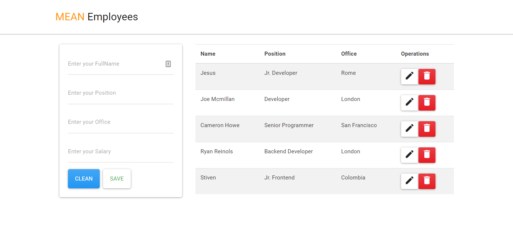

# MEAN Employees

MEAN Employees is a simple example project that use NodeJs with Express to backend, and Angular to frontend.



## Installation

clone the repository:
```
https://github.com/strujilloor/MEAN-Employees.git
```
Install the dependencies in back and front:
```
npm install
```

## Usage

You can start the backend and run server go to back/ with the command:
```
npm run serve
```
http://localhost:4000/api/employees to see your app.

You can start the frontend got to frontend/ with the command:
```
ng serve -o
```
Then open http://localhost:4200/ to see your app.